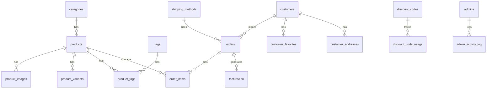
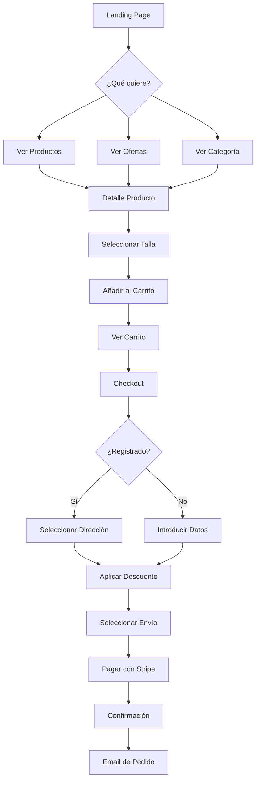
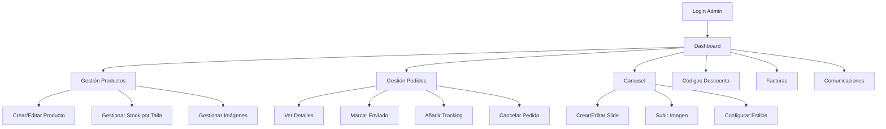

# 📚 FashionMarket - Documentación Completa

> **Tienda E-commerce de Moda Masculina** - Aplicación full-stack con Astro, React, Supabase y Stripe

---

## 1. Descripción General

### Propósito
FashionMarket es una tienda online especializada en moda masculina premium (camisas, pantalones, trajes). Incluye:
- **Tienda pública**: Catálogo, carrito, checkout con Stripe, cuenta de cliente
- **Panel de administración**: Gestión de productos, pedidos, carousel, códigos de descuento, facturación

### Stack Tecnológico

| Tecnología | Uso |
|------------|-----|
| **Astro 5.x** | Framework principal (SSR + SSG) |
| **React 19** | Componentes interactivos (Islands) |
| **Supabase** | Base de datos PostgreSQL + Autenticación |
| **Stripe** | Procesamiento de pagos |
| **TailwindCSS 4** | Estilos |
| **Nanostores** | Estado global (carrito) |
| **Resend** | Envío de emails transaccionales |
| **Cloudinary** | Almacenamiento de imágenes |

### Dependencias Principales
```json
{
  "@astrojs/node": "^9.5.1",
  "@astrojs/react": "^4.4.2",
  "@supabase/supabase-js": "^2.90.0",
  "nanostores": "^1.1.0",
  "stripe": "^20.1.2",
  "resend": "^6.7.0",
  "recharts": "^3.7.0"
}
```

---

## 2. Arquitectura del Proyecto

### Estructura de Carpetas

```
FashionStore/
├── src/
│   ├── components/         # Componentes Astro
│   │   ├── islands/        # React Islands (interactivos)
│   │   └── NewsletterPopup.astro
│   ├── layouts/            # Layouts base
│   ├── lib/                # Lógica de negocio
│   │   ├── supabase.ts     # Cliente DB + funciones CRUD
│   │   ├── admin-notifications.ts
│   │   ├── email-styles.ts
│   │   └── utils.ts
│   ├── pages/
│   │   ├── api/            # Endpoints API REST
│   │   ├── admin/          # Panel de administración
│   │   ├── productos/      # Páginas de productos
│   │   ├── checkout/       # Flujo de pago
│   │   ├── cuenta/         # Área de cliente
│   │   └── index.astro     # Landing page
│   ├── stores/             # Estado global
│   │   └── cart.ts         # Carrito con Nanostores
│   └── styles/             # CSS global
├── supabase/
│   ├── schema.sql          # Schema principal
│   ├── customers-schema.sql
│   ├── admin-schema.sql
│   ├── carousel-schema.sql
│   ├── discount-codes-schema.sql
│   └── migrations/         # Migraciones incrementales
├── public/                 # Assets estáticos
└── email-previews/         # Previsualizaciones de emails
```

### Patrones de Diseño

1. **Island Architecture**: Solo componentes React interactivos se hidratan en el cliente
2. **Server-Side Rendering (SSR)**: Páginas dinámicas con datos de Supabase
3. **Repository Pattern**: `supabase.ts` centraliza todo el acceso a datos
4. **Atomic State**: Nanostores para estado del carrito compartido entre islands

---

## 3. Base de Datos (Supabase)

### Diagrama ER



### Tablas Principales

| Tabla | Descripción |
|-------|-------------|
| `categories` | Categorías de productos (camisas, pantalones, trajes) |
| `products` | Productos con precio, descripción, estado de oferta |
| `product_images` | Imágenes de productos (URLs de Cloudinary) |
| `product_variants` | Stock y precio por talla (XS, S, M, L, XL, XXL) |
| `tags` / `product_tags` | Etiquetas para filtrado (colores, estilos) |
| `orders` | Pedidos con estado (pending, paid, shipped, delivered, cancelled) |
| `order_items` | Líneas de pedido con producto, cantidad, talla, precio |
| `customers` | Perfiles de clientes registrados (vinculados a auth.users) |
| `customer_addresses` | Direcciones guardadas de clientes |
| `customer_favorites` | Productos favoritos |
| `shipping_methods` | Métodos de envío (Estándar, Express) |
| `discount_codes` | Códigos promocionales (porcentaje o cantidad fija) |
| `discount_code_usage` | Registro de uso de códigos |
| `carousel_slides` | Slides del carrusel del homepage |
| `facturacion` | Facturas generadas con desglose completo |
| `admins` | Usuarios administradores con password hasheado |
| `admin_activity_log` | Log de acciones de administradores |
| `settings` | Configuración global (ofertas habilitadas, umbral envío gratis) |
| `newsletter_subscribers` | Suscriptores al newsletter |

### Políticas RLS Principales

| Tabla | Política |
|-------|----------|
| `products` | Lectura pública solo para productos activos |
| `orders` | Anónimos pueden insertar pedidos pending; autenticados ven los suyos |
| `customers` | Solo ven/editan su propio perfil |
| `admins` | Acceso completo vía service_role key |

### Funciones y Procedimientos

- `verify_admin_credentials(email, password)` → Verifica login de admin
- `create_admin(email, password, name, role)` → Crea nuevo administrador
- `handle_new_user()` → Trigger que crea perfil de customer al registrarse
- `add_to_favorites(product_id)` → Añade a favoritos
- `create_order_from_cart(items, address)` → Crea pedido completo
- `cancel_order_procedure` → Cancela pedido y restaura stock

---

## 4. Funcionalidades Principales

### 🛒 Carrito de Compras

**Flujo:**
1. Usuario selecciona producto y talla
2. Click en "Añadir al carrito" → `AddToCartButton.tsx`
3. Estado se guarda en Nanostores (`cart.ts`) + localStorage
4. Sidebar del carrito se abre mostrando items → `CartSlideOver.tsx`

**Componentes:**
- `AddToCartButton.tsx` - Selector de talla + botón añadir
- `CartSlideOver.tsx` - Panel lateral del carrito
- `CartIcon.tsx` - Icono con contador

**Estado:**
```typescript
// stores/cart.ts
$cart: CartItem[]       // Items actuales
$cartCount: number      // Total de unidades
$cartTotal: number      // Precio total
```

---

### 💳 Checkout y Pagos

**Flujo:**
1. Usuario va a `/checkout` con items del carrito
2. Introduce datos de envío (o selecciona dirección guardada si está logueado)
3. Aplica código de descuento (opcional) → `POST /api/discount/validate`
4. Selecciona método de envío
5. Click "Pagar" → `POST /api/checkout/create-session`
6. Redirección a Stripe Checkout
7. Webhook de Stripe confirma pago → `POST /api/webhooks/stripe`
8. Pedido se marca como `paid`, stock se decrementa

**Endpoints:**
| Endpoint | Método | Descripción |
|----------|--------|-------------|
| `/api/checkout/create-session` | POST | Crea sesión de Stripe |
| `/api/checkout/success` | GET | Página de éxito post-pago |
| `/api/webhooks/stripe` | POST | Webhook de Stripe |
| `/api/discount/validate` | POST | Valida código promocional |

---

### 👤 Autenticación de Clientes

**Flujo:**
1. Registro/Login via Supabase Auth → `/auth/login`, `/auth/register`
2. Trigger `handle_new_user()` crea perfil en `customers`
3. Usuario accede a su cuenta → `/cuenta`

**Endpoints:**
| Endpoint | Descripción |
|----------|-------------|
| `/api/auth/login` | Login con email/password |
| `/api/auth/register` | Registro de nuevo usuario |

**Páginas:**
- `/auth/login.astro` - Formulario de login
- `/cuenta/index.astro` - Dashboard del cliente
- `/cuenta/pedidos.astro` - Historial de pedidos
- `/cuenta/direcciones.astro` - Direcciones guardadas

---

### 📦 Gestión de Pedidos (Admin)

**Estados del pedido:**
```
pending → paid → shipped → delivered
              ↓
          cancelled
```

**Flujo de envío:**
1. Admin marca pedido como enviado + añade tracking → `/admin/pedidos/[id]`
2. Email automático al cliente con número de seguimiento
3. Admin marca como entregado

**Endpoints:**
| Endpoint | Descripción |
|----------|-------------|
| `/api/orders/[id]` | GET/PATCH pedido específico |
| `/api/orders/cancel` | POST cancela pedido y restaura stock |
| `/api/orders/tracking` | POST actualiza info de envío |

---

### 📧 Newsletter

**Flujo:**
1. Popup aparece en homepage → `NewsletterPopup.astro`
2. Usuario introduce email → `POST /api/newsletter/subscribe`
3. Se guarda en `newsletter_subscribers`
4. Se envía código `WELCOME10` de bienvenida

**Endpoint:**
| Endpoint | Descripción |
|----------|-------------|
| `/api/newsletter/subscribe` | POST suscribe email |

---

## 5. Flujo de la Aplicación

### Customer Journey



### Flujo de Administración



---

## 6. Integraciones Externas

### Stripe

```typescript
// Configuración
const stripe = new Stripe(process.env.STRIPE_SECRET_KEY);

// Crear sesión de checkout
const session = await stripe.checkout.sessions.create({
    mode: 'payment',
    line_items: [...],
    success_url: '/checkout/success?session_id={CHECKOUT_SESSION_ID}',
    cancel_url: '/carrito'
});
```

**Webhook Events:**
- `checkout.session.completed` → Marca pedido como pagado

### Resend (Email)

```typescript
// Configuración
const resend = new Resend(process.env.RESEND_API_KEY);

// Enviar email
await resend.emails.send({
    from: 'FashionMarket <onboarding@resend.dev>',
    to: [email],
    subject: 'Tu pedido ha sido confirmado',
    html: emailTemplate
});
```

**Emails transaccionales:**
- Confirmación de pedido
- Notificación de envío con tracking
- Bienvenida newsletter con código descuento
- Alertas admin (nuevo pedido, stock bajo)

### Cloudinary

```typescript
// Upload preset configurado para uploads sin firmar
PUBLIC_CLOUDINARY_CLOUD_NAME=your-cloud-name
PUBLIC_CLOUDINARY_UPLOAD_PRESET=fashionstore_products
```

---

## 7. Componentes Clave

### React Islands (`src/components/islands/`)

| Componente | Propósito | Props Principales |
|------------|-----------|-------------------|
| `AddToCartButton.tsx` | Selector talla + añadir al carrito | `product`, `stockBySize` |
| `CartSlideOver.tsx` | Panel lateral del carrito | - |
| `CartIcon.tsx` | Icono carrito con contador | - |
| `ProductCard.tsx` | Tarjeta de producto | `product`, `showFavorite` |
| `FilterSidebar.tsx` | Filtros de productos | `categories`, `tags`, `priceRange` |
| `ImageUploader.tsx` | Upload de imágenes | `onUpload`, `folder` |
| `SalesChart.tsx` | Gráfico de ventas (Recharts) | `data` |
| `SizeRecommender.tsx` | Recomendador de tallas | `product` |
| `UserMenu.tsx` | Menú de usuario logueado | `user` |

---

## 8. API Endpoints

### Productos

| Endpoint | Método | Descripción |
|----------|--------|-------------|
| `/api/products/[slug]` | GET | Obtener producto por slug |
| `/api/products/stock` | POST | Actualizar stock por talla |

### Checkout

| Endpoint | Método | Descripción |
|----------|--------|-------------|
| `/api/checkout/create-session` | POST | Crear sesión Stripe |
| `/api/checkout/success` | GET | Página post-pago |

### Pedidos

| Endpoint | Método | Descripción |
|----------|--------|-------------|
| `/api/orders/[id]` | GET | Obtener pedido |
| `/api/orders/[id]` | PATCH | Actualizar pedido |
| `/api/orders/cancel` | POST | Cancelar y restaurar stock |
| `/api/orders/tracking` | POST | Actualizar tracking |

### Administración

| Endpoint | Método | Descripción |
|----------|--------|-------------|
| `/api/admin/login` | POST | Login administrador |
| `/api/admin/products` | GET/POST | Listar/crear productos |
| `/api/admin/carousel` | GET/POST/PUT/DELETE | CRUD carousel |

### Otros

| Endpoint | Método | Descripción |
|----------|--------|-------------|
| `/api/newsletter/subscribe` | POST | Suscribir email |
| `/api/discount/validate` | POST | Validar código descuento |
| `/api/invoice/[id]` | GET | Descargar factura PDF |
| `/api/webhooks/stripe` | POST | Webhook de Stripe |

---

## 9. Variables de Entorno

```bash
# Supabase
PUBLIC_SUPABASE_URL=https://xxx.supabase.co
PUBLIC_SUPABASE_ANON_KEY=eyJ...
SUPABASE_SERVICE_ROLE_KEY=eyJ...

# Stripe
STRIPE_SECRET_KEY=sk_live_...
STRIPE_WEBHOOK_SECRET=whsec_...
PUBLIC_STRIPE_PUBLISHABLE_KEY=pk_live_...

# Cloudinary
PUBLIC_CLOUDINARY_CLOUD_NAME=your-cloud
PUBLIC_CLOUDINARY_UPLOAD_PRESET=fashionstore_products

# Email
RESEND_API_KEY=re_...

# App
PUBLIC_SITE_URL=https://tudominio.com
```

---

## 10. Guía de Desarrollo

### Levantar Proyecto Localmente

```bash
# 1. Clonar e instalar
git clone <repo>
cd FashionStore
npm install

# 2. Configurar variables de entorno
cp .env.example .env
# Editar .env con tus credenciales

# 3. Ejecutar migraciones en Supabase
# Ir a Supabase SQL Editor y ejecutar en orden:
# - schema.sql
# - customers-schema.sql
# - admin-schema.sql
# - carousel-schema.sql
# - discount-codes-schema.sql

# 4. Iniciar desarrollo
npm run dev
# → http://localhost:4321
```

### Deploy a Producción

```bash
# Build
npm run build

# Start (producción con Node adapter)
npm start
```

**Plataformas soportadas:**
- Vercel (recomendado)
- Railway
- Cualquier servidor Node.js

### Convenciones de Código

1. **Componentes Astro**: PascalCase, `.astro`
2. **React Islands**: PascalCase, `.tsx`, en `src/components/islands/`
3. **API Routes**: kebab-case, en `src/pages/api/`
4. **Funciones Supabase**: camelCase, en `src/lib/supabase.ts`
5. **Tipos**: Interfaces con PascalCase en `supabase.ts`

---

## 📝 Documentos Relacionados

- [README.md](./README.md) - Introducción rápida
- [ADMIN_SETUP.md](./ADMIN_SETUP.md) - Configuración de administradores
- [CLOUDINARY_SETUP.md](./CLOUDINARY_SETUP.md) - Configuración de Cloudinary
- [WEBHOOK_SETUP.md](./WEBHOOK_SETUP.md) - Configuración de webhooks Stripe
- [DEPLOY.md](./DEPLOY.md) - Guía de despliegue

---

*Documentación generada el 23 de enero de 2026*
